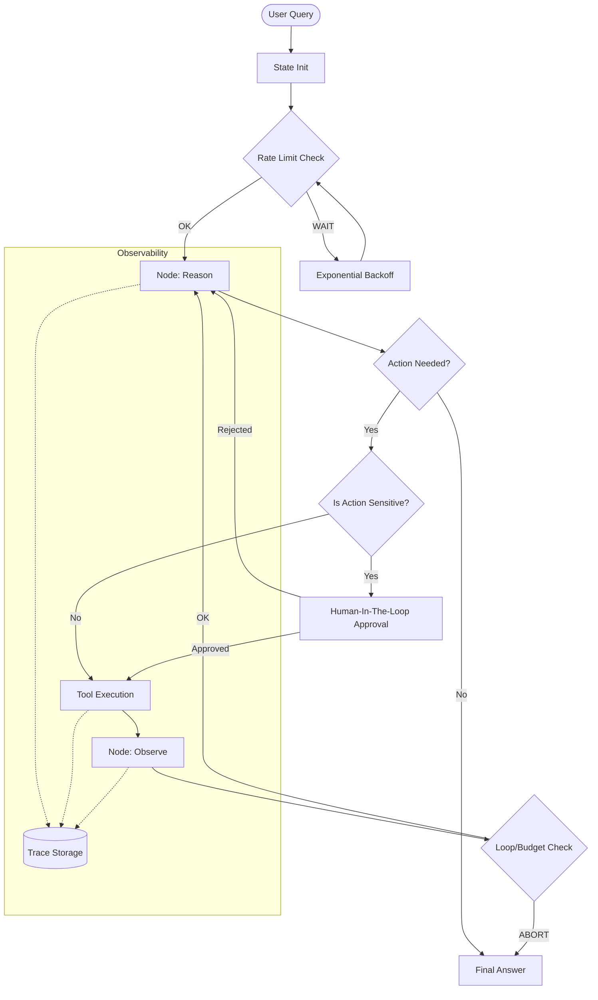

# GUARDIAN-AGENT Architecture Blueprint

Building a production-grade, self-healing ReAct agent with security at its core.

## 1. Project Structure

```text
GUARDIAN-AGENT/
├── .env                # API Keys (Groq, Tavily)
├── requirements.txt    # dependencies
├── main.py             # CLI Entry point
├── app.py              # Streamlit Dashboard (Observability)
├── core/
│   ├── engine.py       # LangGraph State Machine (ReAct Loop)
│   ├── nodes.py        # Decision, Action, Observation logic
│   └── tools/
│       ├── registry.py # Tool fallback & standardization logic
│       ├── search.py   # Tavily integration (+ timeout/fallback)
│       ├── python.py   # Sandboxed exec (+ HITL prompt)
│       └── math.py     # Calculator (+ LLM fallback)
├── security/
│   ├── rate_limit.py   # Token-bucket implementation
│   ├── privacy.py      # Log scrubber (Regex-based)
│   └── validator.py    # .env and config validation
└── obs/
    ├── tracer.py       # TraceEvent dataclasses & recorder
    └── metrics.py      # Token & Cost tracking
```

## 2. Core Data Flow (ReAct + Security)



## 3. The 5 Security Pillars

| Pillar | Mechanism | Objective |
| :--- | :--- | :--- |
| **Pillar 0: Secrets** | `.env` validation + Scoped Loading | Prevent secret leakage into logs/traces. |
| **Pillar 1: Access** | HITL (Human-In-The-Loop) | Mitigate "Vibe Coding" risks for code execution. |
| **Pillar 2: Reliability** | Exponential Backoff + Fallbacks | Handle 429 errors and brittle tool outputs. |
| **Pillar 3: Privacy** | PII/Key Scrubber | Ensure observability data is safe for sharing. |
| **Pillar 4: Budget** | Token & Step Hard-Limits | Prevent runaway loops and unexpected costs. |

---

## 4. Layer Definitions (Revisited)

- **Layer 0 (Security)**: `security/` module. Runs before every LLM/Tool call.
- **Layer 1 (Logic)**: `core/engine.py`. The LangGraph state machine.
- **Layer 2 (Tools)**: `core/tools/`. Encapsulated functions with `try/except` fallbacks.
- **Layer 3 (Obs)**: `obs/`. Real-time event logging to a shared state.
- **Layer 4 (Recovery)**: Self-healing logic within `nodes.py` to pivot if a tool fails.
